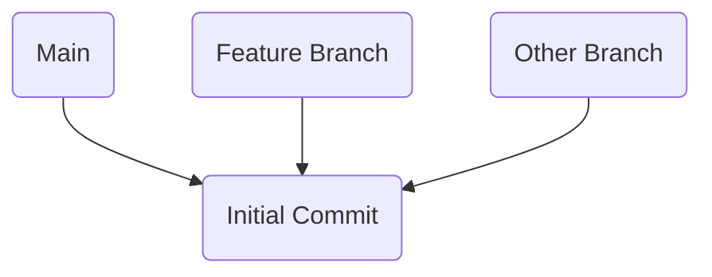
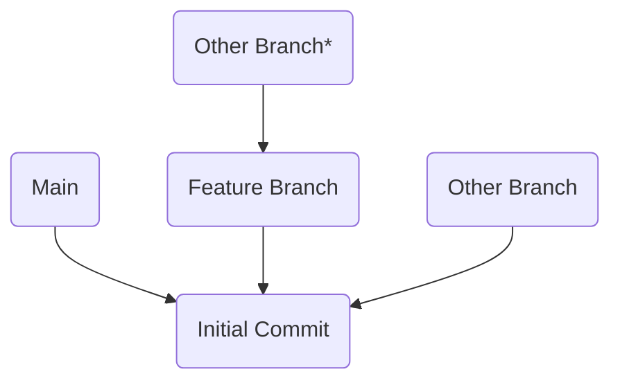

# Git Workshop Cherry-Pick

Use `git cherry-pick` to apply the single commit from branch `other` onto the branch `feature`.

# Diagrams

## Before

```mermaid
  graph TD;
      main(Main) --> IC(Initial Commit);
      feature(Feature Branch) --> IC(Initial Commit);
      other(Other Branch) --> IC(Initial Commit);
```

## After

```mermaid
  graph TD;
      main(Main) --> IC(Initial Commit);
      othercpy(Other Branch*) --> feature(Feature Branch) --> IC(Initial Commit);
      other(Other Branch) --> IC(Initial Commit);
```
